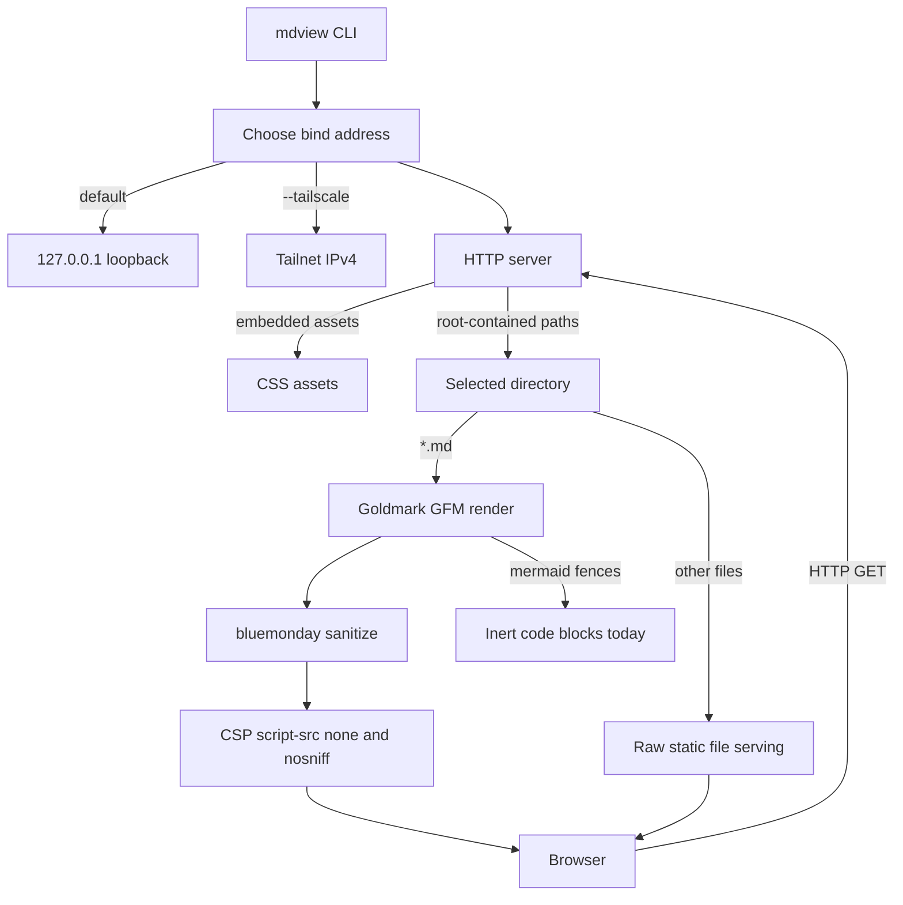

# markdown-remote-viewer

`markdown-remote-viewer` provides `mdview`, a small Go CLI that serves a
Markdown directory through a loopback HTTP server. It is designed as a
single-binary foundation for local and SSH-friendly Markdown viewing workflows.

Implementation status: the Go CLI, HTTP server, embedded static assets,
Markdown-to-HTML preview, CI, and release metadata are present. Mermaid
diagram rendering is tracked as follow-up work; Mermaid code fences are shown
as inert code blocks for now.

## 1. Architecture



## 2. Project Docs

- `CONTRIBUTING.md` covers local development workflow and repository checks.
- `RELEASING.md` covers tag-based and manual releases, version metadata, and
  expected artifacts.
- `.goreleaser.yaml` defines the platform archives for the `mdview` binary.

## 3. Install

With Go:

```sh
go install github.com/i9wa4/markdown-remote-viewer/cmd/mdview@latest
```

## 4. Upgrade

For Go installs, rerun the install command:

```sh
go install github.com/i9wa4/markdown-remote-viewer/cmd/mdview@latest
```

For a pinned version, replace `latest` with a release tag:

```sh
go install github.com/i9wa4/markdown-remote-viewer/cmd/mdview@vX.Y.Z
```

## 5. Build From Source

A fresh checkout can build one runnable `mdview` binary with Go:

```sh
go build -trimpath -o ./mdview ./cmd/mdview
```

The binary includes the viewer stylesheet through Go embedding, so no runtime
asset directory is required.

## 6. Usage

Serve the current directory:

```sh
mdview
```

Serve a specific directory:

```sh
mdview docs
```

Bind to a fixed local port:

```sh
mdview --port 8080 docs
```

Serve from an Ubuntu SSH destination and open it from a Mac on the same
Tailnet:

```sh
mdview --tailscale --port 8080 docs
```

By default, `mdview` binds to `127.0.0.1` and prints the effective local URL.
The default does not expose the server publicly.

Use `--tailscale` when the server machine and your local browser are connected
through Tailscale. In that mode, `mdview` detects the server machine's Tailnet
IPv4 address, binds there, and prints a URL that can be opened directly from
the Mac. Open the `URL:` line from the startup output. `--tailscale` is
explicit and cannot be combined with `--addr`.

Markdown files ending in `.md` are rendered as HTML preview pages. Raw HTML in
Markdown is not trusted: rendering uses safe defaults and sanitizes generated
HTML before it is sent to the browser. Other files are served as static files
from the selected directory.

| Invocation             | Purpose                                      |
| ---------------------- | -------------------------------------------- |
| `mdview`               | Serve the current directory on loopback.     |
| `mdview docs`          | Serve `docs` on loopback.                    |
| `mdview --port 8080 .` | Serve the current directory on a fixed port. |
| `mdview --tailscale .` | Serve on the Tailscale network.              |
| `mdview --version`     | Print version metadata.                      |
